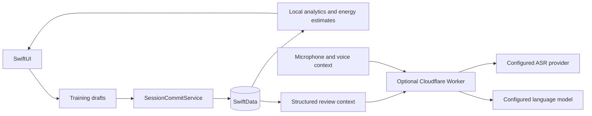

# 架构

应用是 SwiftUI 前端，GymLogKit 封装 SwiftData 模型、草稿、统计、导入导出及云端协议。网络服务是可选组件。

核心关系：Client 拥有 WorkoutSession 和 BodyMetric；课次按 SessionBlock 编排，普通块含 ExerciseEntry 与 SetLog，WOD 保存版本化处方与结果。Exercise 是通用动作库，SessionTemplate 是可复用模板。

训练草稿与历史持久化分离。计划值、实际值、负重、单位必须分别维护；实际缺失不等于零。新建或复制计划不得制造完成记录。WOD 的器械 cal 是独立单位。

TrainingInsights 在本地估算消耗，并记录体重来源及规则版本。TrainingReviewService 调用配置的服务，只返回结构化评价；TrainingReviewCoordinator 在保存前检查记录、目标及历史上下文指纹，避免过期回复覆盖变化后的数据。AI 评价不直接执行训练修改。

完整备份使用独立 DTO，新增字段须保持旧文件可解码。不要只增加 SwiftData 字段而忽略备份导入、导出、草稿恢复、课次互传和历史编辑的语义。
