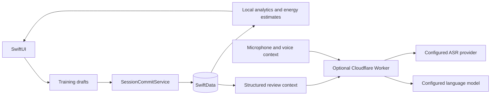

# 架构

应用是 SwiftUI 前端，GymLogKit 封装 SwiftData 模型、草稿、统计、导入导出及云端协议。网络服务是可选组件。

```mermaid
flowchart LR
    UI[SwiftUI] --> Draft[Training drafts]
    Draft --> Commit[SessionCommitService]
    Commit --> DB[(SwiftData)]
    DB --> Analytics[Local analytics and energy estimates]
    Analytics --> UI
    DB --> Review[Structured review context]
    Review --> Relay[Optional Cloudflare Worker]
    Voice[Microphone and voice context] --> Relay
    Relay --> ASR[Configured ASR provider]
    Relay --> LLM[Configured language model]
```

核心关系：Client 拥有 WorkoutSession 和 BodyMetric；课次按 SessionBlock 编排，普通块含 ExerciseEntry 与 SetLog，WOD 保存版本化处方与结果。Exercise 是通用动作库，SessionTemplate 是可复用模板，不额外建模——一般训练模板、Superset 模板（唯一一个 `.superset` block）、WOD 模板（唯一一个 `sectionKind == .wod` 的 block）全部是 SessionTemplate，只按 block 形状区分（`isSupersetOnly`/`isWODOnly`），三个模板库在动作库界面里互不重叠展示。

训练草稿与历史持久化分离。计划值、实际值、负重、单位必须分别维护；实际缺失不等于零。新建或复制计划不得制造完成记录。WOD 的器械 cal 是独立单位。

TrainingInsights 在本地估算消耗，并记录体重来源及规则版本。TrainingReviewService 调用配置的服务，只返回结构化评价；TrainingReviewCoordinator 在保存前检查记录、目标及历史上下文指纹，避免过期回复覆盖变化后的数据。AI 评价不直接执行训练修改。

完整备份使用独立 DTO，新增字段须保持旧文件可解码。不要只增加 SwiftData 字段而忽略备份导入、导出、草稿恢复、课次互传和历史编辑的语义。

## Flexible load entry

The shared transactional `LoadPickerSheet` is used in Today, Supersets and history quick edits. Its compact sheet opens directly on the current load wheel, without a general load-type menu. Numeric entry has separate value and kg/lb wheels plus a small manual-input row. Both numeric and band wheels use the precision-scale decoration: fine ticks, subtle center rules and a restrained marker, using the sheet canvas and shared theme colors without a separate background panel. Decoration ignores hit testing and accessibility; native Picker scrolling and values remain authoritative. Band exercises add only a Band / Weight segmented switch; custom band names and counts are hidden behind Custom. Bodyweight is the zero row in its numeric wheel. Existing per-side, assisted, sled, machine-level and descriptive loads keep their semantics; legacy descriptions can be edited in a compact field or switched to numeric weight. Descriptions are excluded from numeric analytics.

`LoadSelectionDraft` does not mutate the session until confirmation. Unchanged imported loads retain their original representation. Kilograms remain the canonical stored quantity; the source text retains the selected value/unit, so an entered pound value reopens and displays in pounds without repeated conversion loss. Explicit numeric selections carry their mode in that text (for example `absolute: 25 lb`), preserving compatibility with the existing LoadValue wire format and distinguishing deliberately added weight from legacy assistance inferred from exercise classification. No database migration is required.

Changing the unit wheel keeps the entered number (20 kg becomes 20 lb); reopening preserves the recorded unit. kg and lb custom presets are stored separately. The usual wheel range is a convenience only: manual input accepts 0 to 1000 kg (about 2204.6 lb) in every load editor, and a large jump (at least double and 20 kg more than the replaced value, or above 300 kg without one) asks for confirmation. A per-side load with a plain rep count counts toward volume as load × reps × 2 (reps on each side); max-load comparisons still use the single-side value. Assistance and explicitly added weight that conflict with the exercise's comparison direction are excluded from that exercise's max-load PR series rather than compared as equivalent loads. Free descriptions are preserved without guessing a numeric load.
